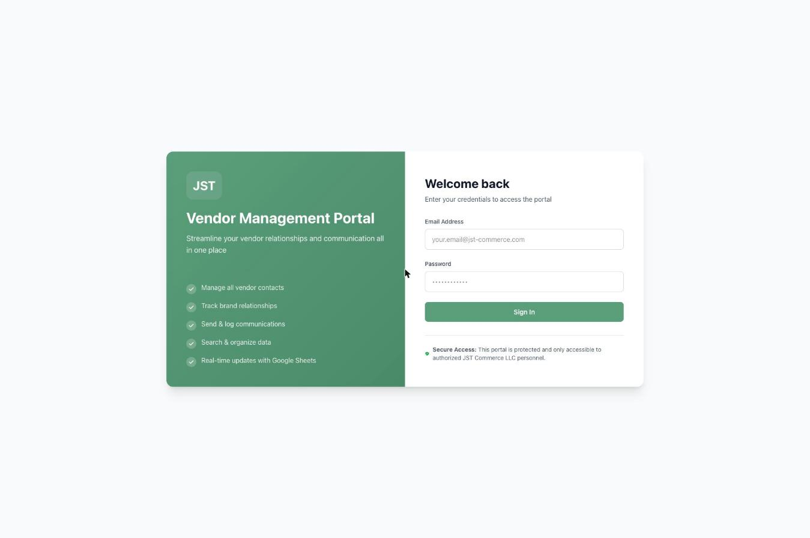
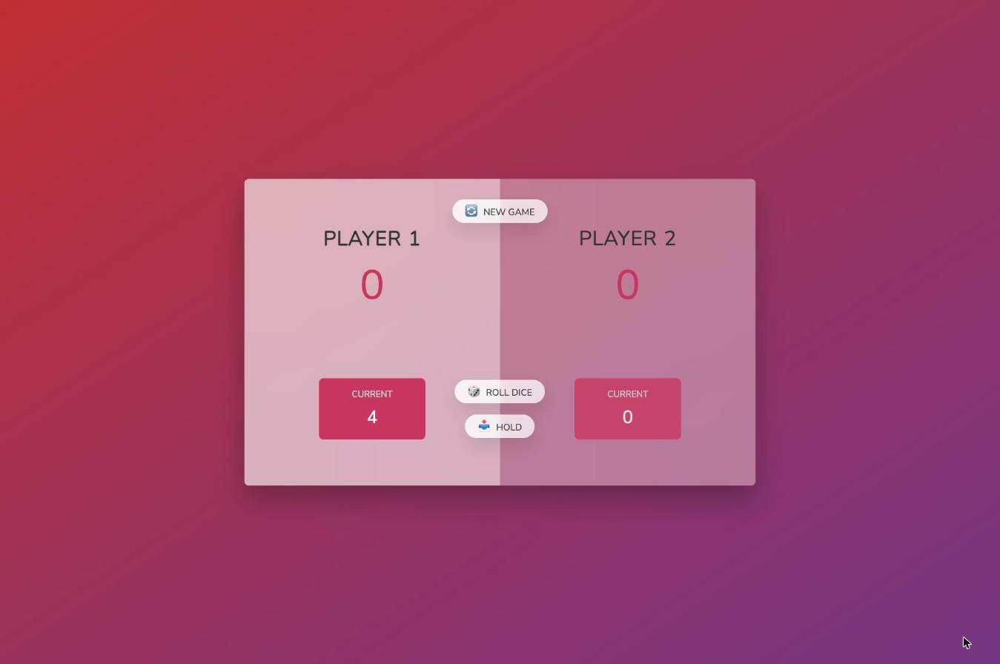
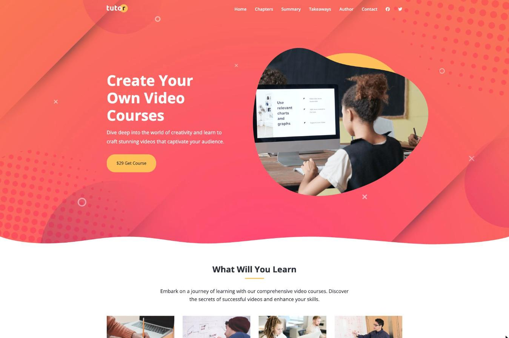
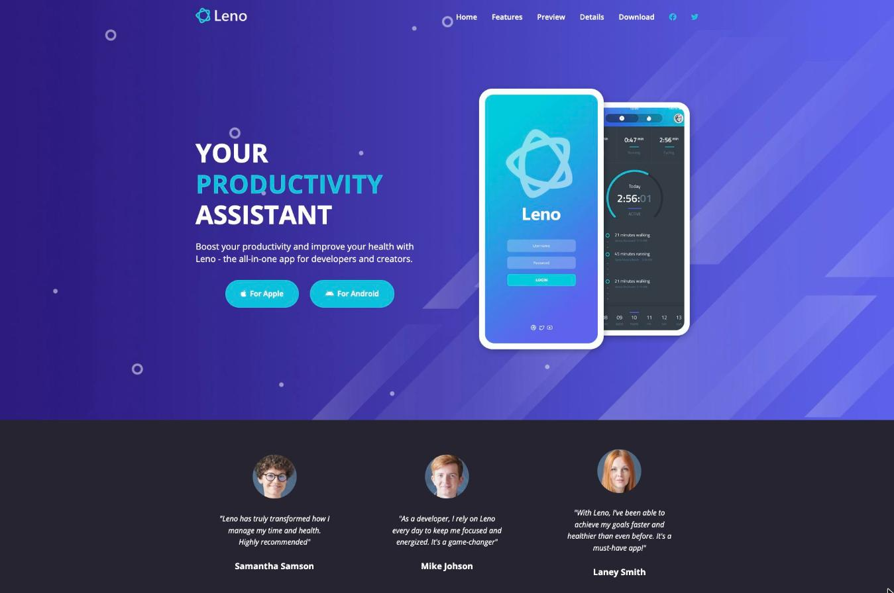

<div align="center">

<a href="https://github.com/Juansint"></a>

<a href="https://www.linkedin.com/in/juanc-dominguez"></a>
<a href="mailto:carldominguez@jst-commerce.com"></a>


</div>

## Sobre mí

```ts
const juanCarlos = {
  rol: "Full-stack developer",
  empresa: "JST Commerce LLC — fundador",
  enfoque: ["SaaS para pymes", "automatización", "integraciones (pagos, banca, IA)"],
  formacion: ["DAW · Desarrollo de Aplicaciones Web", "Máster en Data Analytics"],
  ahora: ["JST Leads (Next.js + Supabase + n8n)", "Seguridad web con PortSwigger Academy"],
  idiomas: ["Español (nativo)", "Inglés"],
};
```

## Proyecto principal

<table>
<tr>
<td>

### Reportes Pyme &nbsp;

SaaS de informes financieros para pymes. Conecta cuentas bancarias, categoriza movimientos con IA y genera informes claros para el negocio.


&nbsp;


<sub>Código privado</sub>

</td>
</tr>
</table>

## Más proyectos

<table>
<tr>
<td width="50%" valign="top">
<a href="https://jst-vendor-system.vercel.app/"></a>

**Vendor Portal**<br/>
Gestión de proveedores, marcas y contactos con autenticación y Google Sheets como backend.

  

<a href="https://jst-vendor-system.vercel.app/">Demo →</a>
</td>
<td width="50%" valign="top">
<a href="https://pig-game-three-sandy.vercel.app/"></a>

**Pig Game**<br/>
Juego de dados para dos jugadores en JavaScript vanilla: DOM, estado y eventos.

  

<a href="https://pig-game-three-sandy.vercel.app/">Demo →</a> · <a href="https://github.com/Juansint/PIG-GAME">Código</a>
</td>
</tr>
<tr>
<td width="50%" valign="top">
<a href="https://tutor-website-weld-xi.vercel.app/"></a>

**Tutor**<br/>
Landing page responsive para una plataforma de cursos en vídeo.

  

<a href="https://tutor-website-weld-xi.vercel.app/">Demo →</a> · <a href="https://github.com/Juansint/tutor-website">Código</a>
</td>
<td width="50%" valign="top">
<a href="https://leno-sigma.vercel.app/"></a>

**Leno**<br/>
Landing page responsive para una app de salud y productividad.

  

<a href="https://leno-sigma.vercel.app/">Demo →</a> · <a href="https://github.com/Juansint/Leno">Código</a>
</td>
</tr>
</table>

## Stack

<div align="center">


<br/>


<sub><b>Integraciones:</b> Stripe · Plaid · Resend · PostHog · Sentry · Google APIs · n8n</sub>

</div>

## Actividad

<div align="center">

</div>


